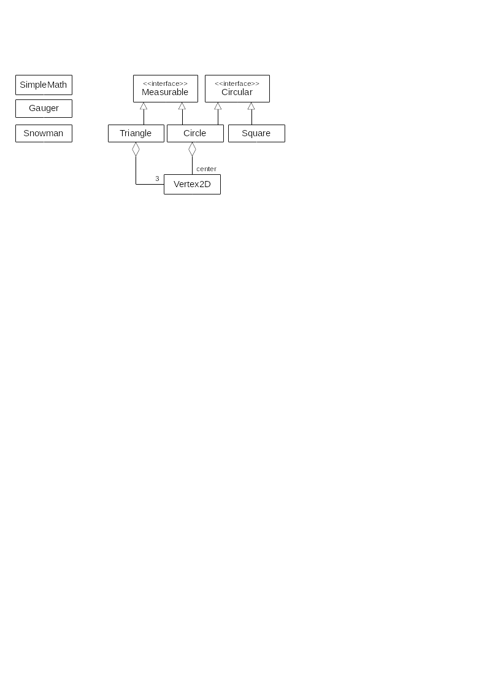

## Fourth iteration

Exercise focused on static methods, implementation and use of interfaces. 

1.  Create the `SimpleMath` class in the `cz.muni.fi.pb162.project.utils` package containing exclusively _static_ methods (so-called _utility class_)
    *   `double minX(Triangle triangle)` returns the minimum X coordinate.
    *   `double minY(Triangle triangle)` returns the minimum Y coordinate.
    *   Similarly for methods `maxX` and `maxY`.
    *   The triangle does not contain `null` elements.

2.  Modify the `Triangle` and  Circle` classes, so they implement the `Measurable` interface.
    *   The height/width of the triangle is calculated as the difference between the maximum and minimum x (width) and y (height) coordinates of the vertices, respectively:
        
    *   Use static methods from the `SimpleMath` class.

3.  In the `utils` package, create the `Gauger` class, which allows you to "measure" objects and print information about their height and width. The class will contain two static overloaded `printMeasurement` methods:
    *   The first method takes any measurable object (ie any object implementing the `Measurable` interface) and
        *   prints _"Width: \<w\>"_, to the standard output where \<w\> is the width value,
        *   on the next line prints _"Height: \<h\>"_, where \<h\> is the height value.
    *   The second method will work especially for a triangle (object of type `Triangle`). It takes a triangle and
        *   prints triangle information to standard output, see `toString()` method,
        *   on the next line prints _"Width: \<w\>"_, to the standard output where \<w\> is again the width value,
        *   on the next line prints _"Height: \<h\>"_, where \<h\> is again the height value.
    *   Avoid repeating the code by calling the first variant of the method from the second variant. But be careful that the method won't call itself.

        There would be a loop (`StackOverflowException`).

4.  The `Circle` class will implement the `Circular` interface - a circular shape expressed by its center and radius.
    The circle directly represents a circular shape, so there is no need to implement any new methods. However, it is necessary to add annotation `@Override`.

5.  In the `geometry` package, create the `Square` class. In our view, a square will not be expressed as four vertices (as in a triangle), 
	but as a circular shape, the vertices of which can be calculated at any time from the center and radius (circumscribed circles). 
	The similarity between the circle and the square may sound a little strange, but you can also put "square" wheels on the car instead of "round" ones.
	The car will still go, it'll just rumble a lot more :-)
    *   The class will implement the `Circular` interface:
    *   The first constructor takes as input parameters the coordinates of the center of the circumscribed circle and the **diameter** of the circumscribed circle.
    *   The second constructor will take a `Circular` object (containing the coordinates of the center and **radius**) as an input parameter and will call the first constructor.
    *   The `Vertex2D getVertex(int index)` method returns the coordinates of the `index`-th vertex. The coordinates are calculated automatically from the center and the radius so that they represent a square rotated by 45°: At index 0 is the left vertex, 1 = lower vertex, 2 = right vertex and 3 = upper vertex.
        If the index is out of range, the method returns `null`.
    *   Don't forget the method `toString()`:

            "Square: vertices=[ax, ay] [bx, by] [cx, cy] [dx, dy]"

6.  In the `geometry` package, create the `Snowman` class:
    *   Our snowman consists of any **four** circular objects, ie circles, squares, etc. stacked on top of each other.
        The number can be easily changed at the time of translation. The snowman has no hands for simplicity. The "balls" of the snowman shrink upwards. 
    *   The constructor will take as its first parameter a parameter of type `Circular`, which represents the lower sphere.
	*   The second parameter of the constructor will be the reduction factor (real number of the range `(0..1>`). The upper parts of the snowman will shrink by this factor.
        If the input parameter is not in the required range, the named non-public constant `0.8` is used.
    *   The whole snowman is created in the constructor. It will consist of a circular object that we received. Above it will be circles (`Circle`) gradually decreasing by a given factor. 
	*   Don't be afraid to split the constructor code into smaller private methods.
    *   The `Circular[] getBalls()` method returns an array of all "spheres" from the lowest to the highest.

7. The demo creates a square with center `[0, 0]`, diameter of circle `100` and writes information about it to standard output.

8. Draw draws [a snowman whose bottom circle has a green square inscribed in it](https://gitlab.fi.muni.cz/pb162/pb162-course-info/wikis/draw-images).

### Hints

- The minimum/maximum value must be initialized to the first element, or to constants
  `Double.POSITIVE_INFINITY`/`Double.NEGATIVE_INFINITY`.
- Use `@Override` annotation when implementing interface methods.
- When calling `printMeasurement`, it is necessary to cast the object to the interface. There will be so-called methods "trimming".
- In `Square` in the `toString` method you can use `Stringbuilder` and then the `String#trim()` method.
- `Snowman` will contain a constant indicating the number of circles.

### Target UML class diagram:

