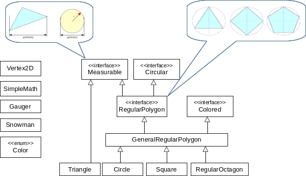

## Fifth iteration

Exercise focused on working with inheritance, interface, and enumeration type.

2D geometry shapes include [regular
polygons](https://en.wikipedia.org/wiki/Regular_polygon).

They are regular square convex objects that have all sides of the same length (equilateral triangle, square, regular pentagon, etc.).
They can be used to describe a circle that passes through all vertices. They, therefore, correspond to our definition of "circular objects" defined by the `Circular` interface.
You can also include circles as an n-gon with infinitely many infinitesimal edges 
(in fact, each regular n-gon approximates a circle &mdash; the more edges, the more accurate the approximation).

1. In the `geometry` package, create an enumeration type `Color`, define some common colors.
   Override the `toString()` method so that it returns the color name in lowercase.

2. In the `geometry` package, create a `Colored` interface containing `get` and `set` method of the type of the defined enumeration type.
   The methods will be named `getColor()` and `setColor()`. Describe them properly.

3.  In the `geometry` package, create a `GeneralRegularPolygon` class that implements the `RegularPolygon` and `Colored` interfaces.
    This class will then serve as a common superclass for all regular n-gons.
    *   A regular n-gon is defined by its _center_, _number of edges_, and _radius of a circumscribed circle_.
        Therefore, the constructor will have exactly these three parameters.
    *   The default color is black (`BLACK`).
    *   The length of the edges is calculated as:
        ,
        where `R` is the radius of the circumscribed circle and `n` number of edges.
    *   The width and height of a regular n-gon are calculated as the diameter of the circumscribed circle.
    *   The coordinates of the i-th vertex are calculated according to the following formula:

        x = Cx - R * cos(i * 2 * PI / n)

        y = Cy - R * sin(i * 2 * PI / n)

        where `C` is the center, `R` is the radius of the circle, `n` is the number of the edges and `i` is the index of the vertex.
    *   Method `toString` will return:

            "<n>-gon: center=
, radius=<radius>, color=<color>"

        where _\<n\>_ is the number of the edges, _\<center\>_ is the center and _\<radius\>_ is the radius of the circumscribed circle
        and _\<color\>_ is the color of the n-gon.

4.  In the `geometry` package, create a `RegularOctagon` class for a regular octagon extending `GeneralRegularPolygon`.
    The constructor contains only the necessary parameters.

5.  Modify the `Circle` class to extend the `GeneralRegularPolygon` class.
    *   The number of the edges of a circle is a constant _maximum integer_ of type `int`.
    *   The default color of the circle is red.
    *   The circle can still be constructed by entering the center and radius.
    *   Clean up the class, ie delete all unnecessary attributes and methods, etc.
    *   The class will contain the original `toString` method.
    *   An inherited `getEdgeLength()` method would not work properly for a circle because the length of the edges should be 0
         &mdash; override it.

6.  Modify the `Square` class to extend the `GeneralRegularPolygon` class, and then clean it up.
    Leave only the constructors and the `toString` method.
    The `getVertex` method will work as defined in the interface.

7.  Edit the `Snowman` class:
    *   The snowman will not be composed of four circumscribed circles, but of ** three ** regular polygons.
    *   The constructor will take a parameter of type `RegularPolygon` as its first parameter.
    *   The `RegularPolygon[] getBalls()` method will then return an array of regular n-gons.
    *   Snowman polygons will have the same number of edges as the bottom (first) polygon.

8. The demo prints a regular octagon with center `[0, 0]` and radius `1`.

9. Draw draws [two snowmen, one from circumscribed circles and one from the given polygons](https://gitlab.fi.muni.cz/pb162/pb162-course-info/wikis/draw-images).

### Hints

- By default, the `toString()` method in `enum` returns the name of the constant in uppercase.
- You will find the necessary mathematical functions and constants in the `java.lang.Math` class.
- The `getVertex(int index)` method assumes any number and does not require a modulo, because goniometric functions work automatically.
- For a better understanding of snowman polygons, take a look at the sample _Draw_ screenshot.

### Target UML class diagram:

