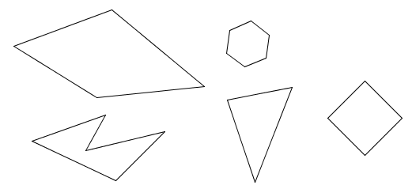

## Sixth iteration

Exercise focused on working with arrays, equality, abstract classes, and basic exceptions.

In previous iterations, we worked with regular n-gons. We will now extend the system with more general so-called simple n-gons.
These are general irregular closed n-gons without intersecting edges, as the following examples show:

Although a regular n-gon is a special case of a simple n-gon, in our object abstraction there will be class hierarchies of regular n-gons_ and _simple n-gons_ separate. This is because regular n-gons are defined by the radius of the circumscribed circle and the number of edges, while simple n-gons must in principle be defined by a list of coordinates of individual vertices.

1.  Define the equality of two vertices (`Vertex2D`) so that two vertices are the same if they have the same coordinates.

    >   Remember that by redefining equality, you have an obligation to redefine another method.

2. Modify the methods in `SimpleMath` to take the `Polygon` interface as a parameter. The `Polygon` interface defines general n-gon methods.

    > Don't forget to update Javadoc.

3.  In the `geometry` package, create an *abstract* `SimplePolygon` class that implements the `Polygon` interface. The `SimplePolygon` class will be general in the sense that it will not anticipate how individual vertices will be stored (arrays, collections, etc.). It leaves it down to subclasses. Therefore, it will implement only the following methods, the others will remain unimplemented:

	> Explicitly write the headers of the abstract methods in the abstract class.

	*   The `getHeight()` method returns the difference between the largest and smallest Y coordinates in an n-gon. Similarly, `getWidth()` for X coordinates.
	
    	> Use the methods from `SimpleMath` to implement `SimplePolygon`.
	
    *   The `toString()` method returns a string:

            "Polygon: vertices = [x, y] [x, y] [x, y]"

        where [x, y] are successively all coordinates of the vertices.

4.  Create an immutable `ArrayPolygon` class that extends the `SimplePolygon` class.
    *   The coordinates of the vertices of the n-gon are stored in an array.
	*   The constructor will have an array of vertices as the input argument. The constructor:
	    * Checks whether the array or any of its elements are `null`.
		* Checks whether the array is empty.
		* If one of these situations happen, then the input is invalid and the constructor 

		  > To throw an exception, use `throw new IllegalArgumentException("message - what happened");`. We'll learn more about exceptions later on. For now, this is the only way how to prevent the creation of invalid object.

		* If the input is correct, then the constructor copies the input array. It is not enough to just store a pointer to the array in the attribute because the array could be modified by the array provider, violiting ecancapsulation principles.

		  > Use methods from the `Arrays` utility class, such as _copyOf_ or _equals_.
		  > When copying an array, a shallow copy is sufficient, as `Vertex2D` objects are immutable.

    *   The `Vertex2D getVertex(int i)` method returns the i-th vertex modulo the number of vertices.
        In the case of a negative input argument, it throws an `IllegalArgumentException` exception with an error description (see the hint above).

		> The modulo character is represented in Java by `%`

    *   Define equality methods. The two `ArrayPolygons` are the same if all vertex indices are the same. Use `getClass()`, not `instanceof`, to compare classes. Reason: see the lecture.

        > Remember the contract of the` equals` method: the method must be symmetrical, i.e., `new ArrayPolygon(...).equals(new Triangle(...))` must return the same result as `new Triangle(...).equals(new ArrayPolygon(...))`. Even if the points of the triangle and the polygon are the same, `equals` returns `false`, because they are different classes.
        
        **Example** *Following triangles **are not** the same*:
        *   [1, 1] [2, 2] [3, 3]
        *   [3, 3] [1, 1] [2, 2]
        
5.  Modify the `Triangle` class to extend the `ArrayPolygon` class:
    *   The constructor will remain in its original form, i.e, it will take three specific vertices as its input arguments and pass them to the superclass constructor in the form of an array of vertices.

	    >  Use the following syntax to enumerate array elements: `new Vertex2D[] { /* elements */ }`

    *   Remove all attributes and methods that can be inherited without change, except the `toString()` method.
	
6. If you implemented everything without any errors, then after running the `Draw` class, a [purple triangle will be drawn on the screen and inside it a purple polygon](https://gitlab.fi.muni.cz/pb162/pb162-course-info/wikis/draw-images)
   (make no sense in its shape :wink: ).

### Target UML class diagram:

