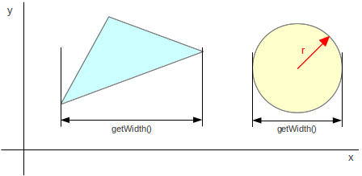

## Čtvrtá iterace

Cvičení zaměřené na statické metody, implementaci a použití rozhraní. Cílový UML diagram tříd vypadá následovně:

1.  Vytvořte třídu `SimpleMath` v balíku `cz.muni.fi.pb162.project.utils` obsahující výhradně _statické_ metody (tzv. _utility class_)
    *   `double minX(Triangle triangle)` vrátí nejmenší X-ovou souřadnici.
    *   `double minY(Triangle triangle)` vrátí nejmenší Y-ovou souřadnici.
    *   Obdobně pro metody `maxX` a `maxY`.
    *   Trojúhelník neobsahuje `null` prvky.

2.  Upravte třídy `Triangle` a `Circle` tak, aby implementovaly rozhraní `Measurable`.
    *   Výška/šířka trojúhelníku se vypočítá jako rozdíl maximální a minimální x-ové (u šířky) respektive y-ové
        (u výšky) souřadnice vrcholů:

        
    *   Využijte statické metody ze třídy `SimpleMath`.

3.  V balíku `utils` vytvořte třídu `Gauger` (_měřidlo_), která umožní "změřit" objekty a vypsat informace o jejich výšce a šířce. Třída bude obsahovat dvě statické přetížené metody `printMeasurement`:
    *   První metoda vezme libovolný měřitelný objekt (tj. libovolný objekt implementující rozhraní `Measurable`) a
        *   na standardní výstup vypíše _"Width: \<w\>"_, kde \<w\> je hodnota šířky,
        *   na další řádek vypíše _"Height: \<h\>"_, kde \<h\> je hodnota výšky.
    *   Druhá metoda bude speciálně pro trojúhelník (objekt typu `Triangle`). Vezme trojúhelník a
        *   na standardní výstup vypíše informace o trojúhelníku, viz metoda `toString()`,
        *   na další řádek vypíše _"Width: \<w\>"_, kde \<w\> je opět hodnota šířky,
        *   na další řádek vypíše _"Height: \<h\>"_, kde \<h\> je opět hodnota výšky.
    *   Vyhněte se opakování kódu tím, že druhá varianta metody bude volat tu první. Pozor ale, ať nevolá sebe sama.
        Došlo by k zacyklení (`StackOverflowException`).

4.  Třída `Circle` bude implementovat rozhraní `Circular` - kruhový tvar vyjádřený svým středem a poloměrem.
    Kružnice přímo představuje kruhový tvar, proto netřeba implementovat žádné nové metody. Je ale nutné přidat anotaci `@Override`.

5.  V balíku `geometry` vytvořte třídu `Square`. V našem pojetí nebude čtverec vyjádřený jako čtveřice vrcholů (jako je tomu u trojúhelníku), 
	ale jako kruhový tvar, jehož vrcholy můžeme kdykoliv vypočítat ze středu a poloměru (opsané kružnice). 
	Podobnost kruhu a čtverce zní možná trochu podivně, ale na auto si také můžete nasadit "čtveratá" kola namísto "kruhových". 
	Auto stále pojede, jen to bude o dost víc drncat :-)
    *   Třída bude implementovat rozhraní `Circular`:
    *   První konstruktor vezme jako vstupní parametry souřadnice středu opsané kružnice a **průměr** opsané kružnice.
    *   Druhý konstruktor vezme jako vstupní parametr objekt typu `Circular` (obsahuje souřadnice středu a **poloměr**) a bude volat první konstruktor.
    *   Metoda `Vertex2D getVertex(int index)` vrátí souřadnice `index`-tého vrcholu. Souřadnice se vypočítají automaticky ze středu a poloměru tak,
	    že budou reprezentovat čtverec otočený o 45°: Na indexu 0 je levý vrchol, 1 = dolní vrchol, 2 = pravý vrchol a 3 = horní vrchol.
        Pokud je index mimo rozsah, vrátí metoda `null`.
    *   Nezapomeňte na metodu `toString()`:

            "Square: vertices=[ax, ay] [bx, by] [cx, cy] [dx, dy]"

        přičemž zpráva obsahuje jen 3 mezery mezi vrcholy.

6.  V balíku `geometry` vytvořte třídu `Snowman` (_sněhulák_):
    *   Nás sněhulák se skládá ze **čtyř** jakýchkoliv kruhových (circular) objektů, tj. kružnic, čtverců, atd. postavených na sebe.
        Počet půjde lehce změnit v době překladu. Sněhulák pro jednoduchost nemá ruce. Směrem nahoru se "koule" sněhuláka zmenšují. 
    *   Konstruktor bude jako svůj první parametr brát parametr typu `Circular`, který představuje spodní kouli.
	*   Jako druhý parametr konstruktoru bude zmenšovací faktor (reálné číslo o rozsahu `(0..1>`). O tento faktor se budou zmenšovat horní části sněhuláka.
        V případě, že vstupní parametr nebude z požadovaného rozsahu, použije se neveřejná pojmenovaná konstanta `0.8`.
    *   Celý sněhulák vznikne v konstruktoru. Bude složen z kruhového objektu, který jsme dostali. Nad ním budou kružnice (`Circle`) postupně se zmenšující o daný faktor. 
	*   Nebojte se kód konstruktoru rozdělit do menších privátních metod.
    *   Metoda `Circular[] getBalls()` vrátí pole všech "koulí" od nejspodnější po nejvyšší.

7. Demo vytvoří čtverec se středem `[0, 0]`, průměrem kružnice `100` a vypíše o něm informace na standardní výstup.

8. Draw vykreslí [sněhuláka, jehož spodní kružnice má v sobě vepsaný zelený
   čtverec](https://gitlab.fi.muni.cz/pb162/pb162-course-info/wikis/draw-images).

### Hinty

- Minimální/maximální hodnota musí být nainicializovaná na první prvek, nebo na konstanty
  `Double.POSITIVE_INFINITY`/`Double.NEGATIVE_INFINITY`.
- Při implementaci metod rozhraní používejte anotaci `@Override`.
- Při volání `printMeasurement` je nutno přetypovat objekt na rozhraní. Dojde k tzv. "ořezání" metod.
- V `Square` v metodě `toString` se dá použít `Stringbuilder` a pak metoda `String#trim()`.
- `Snowman` bude obsahovat konstantu udávající počet kružnic.
